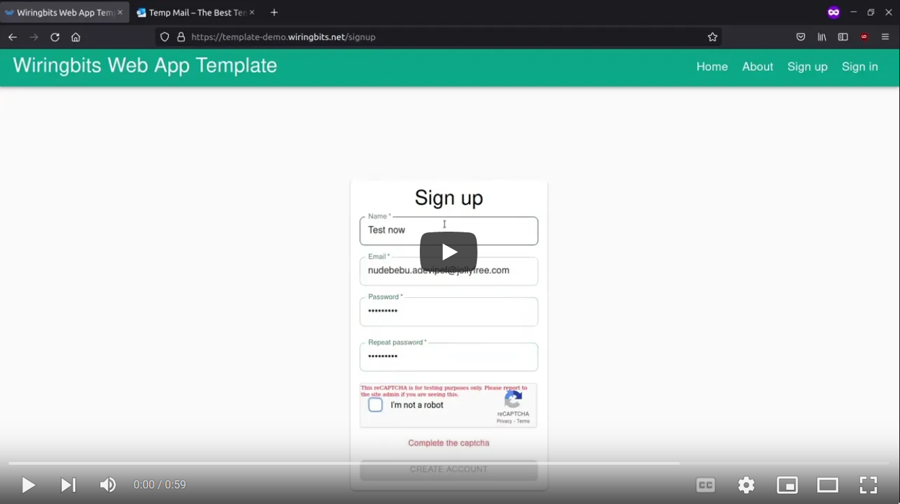
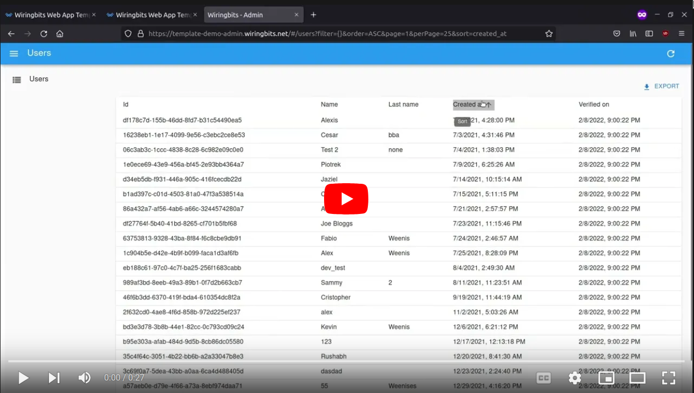
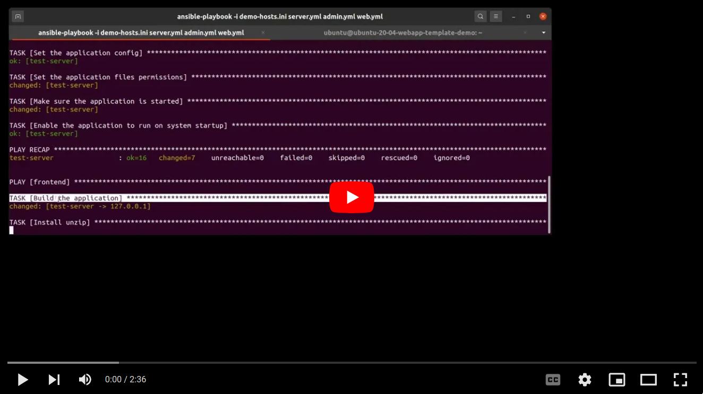

# Wiringbits Web Application Template

This is the skeleton used by Wiringbits when creating new web applications in Scala/Scala.js, so far, we have created ~10 projects from this template, back-porting useful details to improve it.

If you require building a Web Application in Scala while you do not have the time to do many technical choices, this template could be a reasonable choice.

## Why?

Scala has a common misconception, many people believe that it is hard to get productive with it, at Wiringbits, we have proven the contrary with this template. Engineers with no previous Scala experience tend to start contributing simple bug fixes at their first week (including undergrad interns).

Our template provides all the necessary boilerplate to get started fast when building a traditional web application.

Don't waste your time evaluating every library required to build your web app, pick this template and go from there.

Using Scala.js not only save us considerable time, it also allows us to avoid many common issues, for example, all frontend/backend validations are in sync just because the code is the same.

## Demo

We have a live demo so that you can get a taste on what our template provides.

- [Web App](https://template-demo.wiringbits.net) showcases the web application intended for the general user, explore it and create an account to get an idea on what your users will experience.
- [Admin App](https://template-demo-admin.wiringbits.net) (username = `demo`, password = `wiringbits`) showcases the web application intended for administrators, this exposes a way to manage the application's data in a nice UI, mostly autogenerated by [react-admin](https://marmelab.com/react-admin/).
- [API Docs](https://template-demo.wiringbits.net/api/docs/index.html) showcases the [Swagger UI](https://swagger.io/tools/swagger-ui/) which can help to explore the API directly.

### Short videos

Users app 1m demo:

Admin app 30s demo:

Deployment 2m demo:

## What's included?

1. User registration and authentication; Including email verification, profile updates, password recovery, and, captcha for spam prevention.
2. Integration with the React ecosystem, most libraries/components will work right away, while we use [Material UI](https://v3.mui.com/), you can switch to your preferred component library.
3. PostgreSQL as the data store layer, which is a reasonable choice for most web applications.
4. Practical components for testing your server-side code, writing tests for the Data/Api layer is real simple, no excuses accepted.
5. Practical frontend utilities, for example, test your frontend forms easily, consistent UI when performing asynchronous actions (fetching/submitting data), etc.
6. Typed data inputs, don't bother running simple validations to form data at the backend, accepted requests are already validated.
7. Reasonable Continuous-Integration workflows, don't waste time reviewing code format or asking whether tests are passing, Github Actions do this for you.
8. Admin usually have super-powers, which is why you can export most of your Postgres database to an autogenerated UI (https://marmelab.com/react-admin/), just define which tables/columns must be exported.
9. A simple to follow architecture, including short-guides for doing common tasks.
10. Deployment scripts to cloud instances, we believe in simplicity and most projects are fine with simple managed servers instead of containers/K8s/etc.

## Get started

Read the [docs](./docs/README.md) or watch our [onboarding videos](http://onboarding.wiringbits.net).

## Presentations

There have been some presentations involing this project:

- Jan 2023; [ScaLatin](https://scalac.io/scalatin/); [Creando aplicaciones web con Scala/Scala.js](https://www.youtube.com/watch?v=PqI8brUxCRg); [slides](http://scalatin2023.wiringbits.net)
- Oct 2022; [ScalaCon](https://www.scalacon.org/); [A Practical Skeleton for Your Next Scala Scala js Web Application](https://www.youtube.com/watch?v=xWGMr0AsAMU)

## Scala.js bundle size
These are code-size measurements from the deployed version at 5/Feb/2023, overall, Scala.js core is minimal, gzipped versions are usually less than 1Mb.

### Web app

### Admin app

## Hire us

The open source work we do is funded by our Scala/Scala.js consulting and development services, [schedule a call](http://alexis.wiringbits.net/) to hire us for your project.
