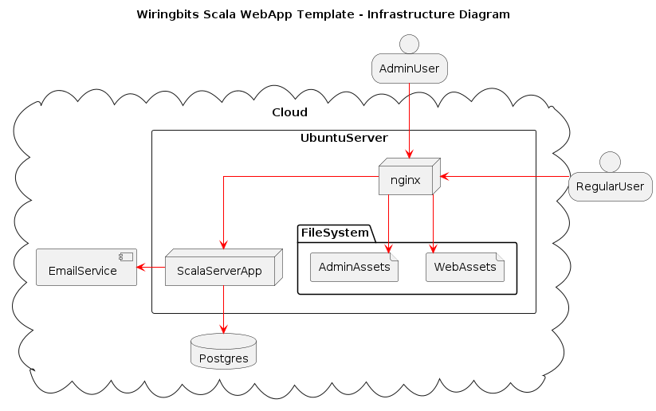
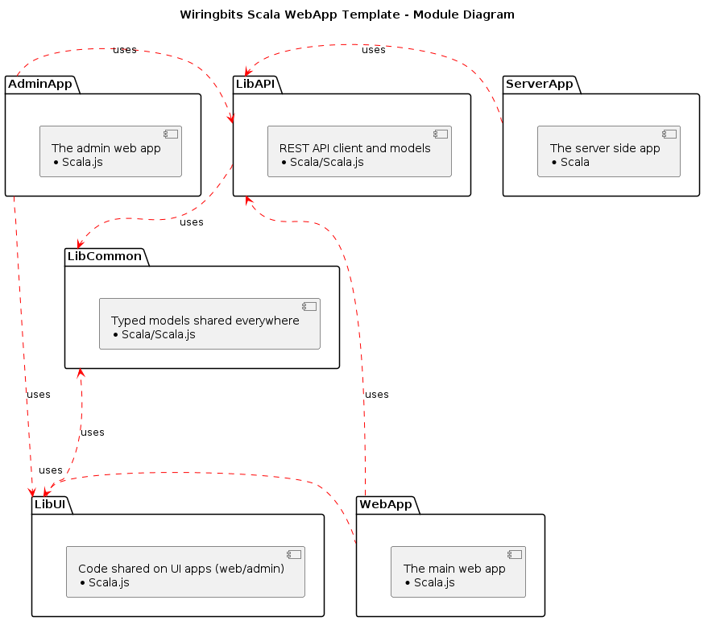
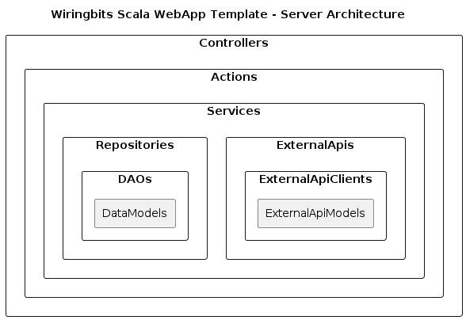
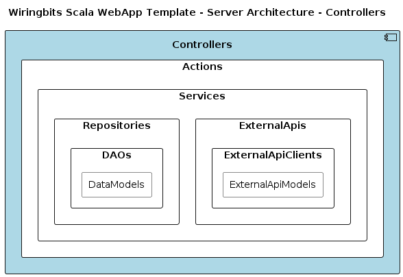
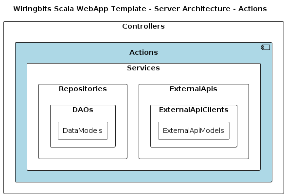
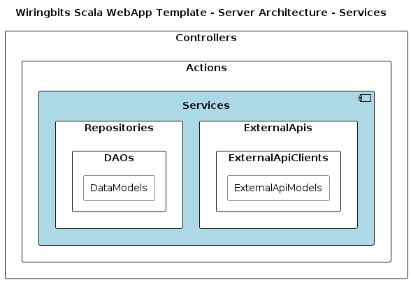
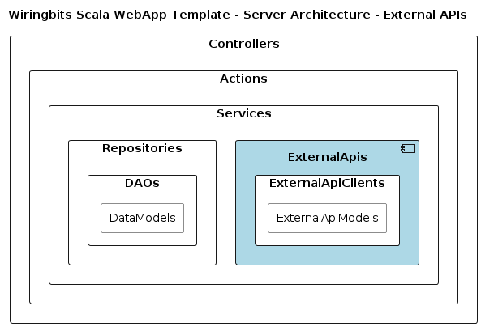
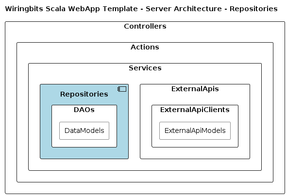
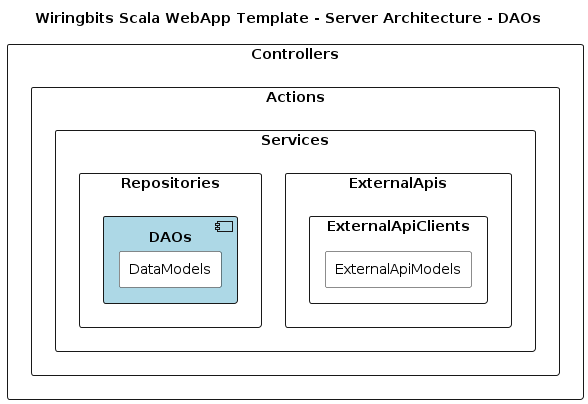

# Architecture

The following diagrams illustrate the overall project architecture.

**Disclaimer** There are some parts of the code (specially `server`) that do not fit the architecture completely, we plan to get there.

## Infrastructure

The [infra](../infra) project includes Ansible scripts to configure your own Server, be sure to check it out.

Summary:

- The app is usually hosted on a cloud server, let it be a DigitalOcean Droplet, an AWS EC2 instance, etc.
- Ubuntu 20.04 is the target OS, newer versions would likely work without issues.
- We recommend a managed database for Postgres.
- While the diagram shows all components in a single server, we can easily separate nginx as a load balancer + many server instances.
- Frontend apps are composed by static assets, stored at the server filesystem.
- `nginx` is the entry point handling user requests, which has a TLS certificate (thanks to LetsEncrypt/CertBot), depending on the domain, it serves the files for the admin or the regular app.
- When the server API is being invoked, `nginx` will route the traffic to the server app.
- The server app connects to postgres and external services when necessary (like AWS SES).
- AWS SES is being used to send emails.

## Modules

The application modules make sure to share code when possible, some of them cross-compile to Scala.js:

- [LibCommon](../lib/common) has code shared over the whole application (Scala/Scala.js), it consists mostly of models.
- [LibAPI](../lib/api) has code shared to the `server` (Scala) and the web apps (Scala.js), it includes all the models defining the request/response for the `server` endpoints, it also includes the API client that web apps use to invoke the `server` app.
- [LibUI](../lib/ui) has code shared between the webapps (Scala.js), while it is mostly empty, it can include reusable components for the UI.
- [Web](../web) has the web app code for the regular user application (Scala.js).
- [Admin](../admin) has the admin app code (Scala.js).
- [Server](../server) has the code for the server app (Scala).

## Server

The server architecture is a mix taking advantage from Domain Driven Design (DDD), Hexagonal Architecture, and, Clean Architecture.

**NOTE** While current diagrams do not display it, there is are some core models that are shared on all layers.

Let's visit the layers from the top to the bottom.

### Controllers

Controllers is the entry point layer for the user requests, it is tied to the http-framework, it has these responsibilities:

- Decode requests into typed models.
- Authenticate requests.
- Delegate the work to the actions layer.
- Encode responses.

### Actions

Actions is the non-framework entrypoint, for example, if the http-layer gets another implementation, there shouldn't be a need to update Actions, it has these responsibilities:

- Actions have 0 knowledge about anything on the `Controllers` layer.
- Each action is represented by a class/file, which has a single public method, commonly called `apply` so that Scala syntactic sugar can be used, like `getCurrentUserAction()`.
- An action can’t depend on another action, when we get to such need, we would usually extract the common functionality into a service which can be invoked from many actions.
- Checks authorization rules.
- Runs complex validations (like the ones requiring interactions with another layers, checking whether an email is already registered could be one example).
- Usually, an action would combine work from other layers, like reading data from a Repository and submitting it to an External API.

### Services

The Services layer is composed of business rules 

Combines the work from Repositories and ExternalApis

Expose functions handling business rules when they get complex enough to fit in Actions:

- Services have 0 knowledge about Actions/Controllers.
- Combines the work from Repositories and ExternalApis

### External APIs

External APIs layer holds anything necessary to communicate with external services, for example, AWS SES.

When working on this layer, it is a good idea to consider that any changes should be extractable into an isolated library, hence, business rules must not go here.

Of course, this layer won't know anything about Controllers/Actions/Services/Repositories.

### Repositories

Repositories is the entry point to the storage layer, given that we use Postgres, this layer is in charge of choosing when an operation requires a transaction.

Given the transactional capabilities, there are times when a repository could deal with small business rules, the ones that matter for data integrity. For example, creating a user could require to store a token used to verify the user's email.

Details:

- The work done by Repositories is mostly composing DAOs.
- Repositories do not know any other layer besides DAOs.
- This layer is **NOT** responsible of validating input format.
- This layer could validate whether an item already exists.

### DAOs

The DAOs (Data-Access-Object) layer is the one that knows how to deal with database tables/rows, transforming operations into SQL statements, as well as parsing results into data models.

DAOs don't know about any other layer.
